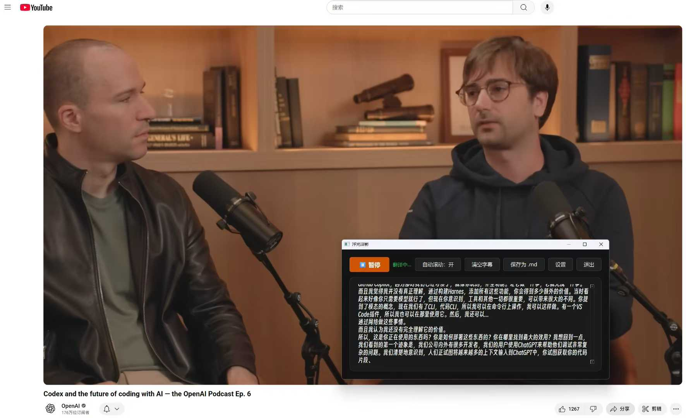

# 浮光译影

实时捕捉系统音频，调用阿里云百炼语音翻译模型生成中文字幕的桌面应用。界面基于 PyQt6，支持浮窗显示、历史字幕保存与手动编辑。

## 主要特性
- **实时翻译**：后台线程捕获系统声音并推送至 DashScope 实时翻译。
- **可编辑字幕区**：字幕按时间顺序累积显示，支持手动修改与自动滚动切换。
- **一键保存**：字幕可异步保存为 Markdown，避免界面卡顿，并带有历史记录查看器。
- **个性化设置**：可调节字体、颜色与透明度，支持配置文件持久化。
- **悬停菜单 / 快捷按钮**：开始、暂停、清空、保存等控制项一应俱全。

## 环境要求
- Python 3.9+
- Windows 10/11（当前音频捕获实现依赖 soundcard 在 Windows 上的 MediaFoundation）

## 快速开始
1. 建议创建虚拟环境并安装依赖：
   ```bash
   pip install -r requirements.txt
   ```
2. 复制配置模板并填写 DashScope 凭证：
   ```bash
   copy config.sample.ini config.ini   # Windows PowerShell
   ```
   打开 `config.ini`，在 `[dashscope]` 小节填写 `api_key`（即 DashScope API Key），如有需要可调整模型、目标语言及显示设置。
3. 运行应用：
   ```bash
   python main.py
   ```

## 使用说明
- 点击左上角按钮开始/暂停翻译；字幕框默认跟踪最新结果，可在“自动滚动”按钮中切换。
- “保存为 .md” 会将当前字幕异步写入用户主目录下的 `浮光译影字幕/` 文件夹，文件名包含时间戳。
- “查看保存” 会打开历史字幕查看器，可预览、刷新或打开对应文件夹。
- 字幕框支持直接编辑，编辑后的内容会同步写入缓存并用于后续追加逻辑。

## 配置文件说明
- `config.ini`：本地私密配置，**已加入 .gitignore**，请勿上传到公共仓库。
- `config.sample.ini`：模板文件，供他人快速复制配置。

## 项目结构
```
├── main.py                # 应用入口
├── requirements.txt       # Python 依赖
├── config.sample.ini      # 配置模板（请复制为 config.ini 使用）
├── src/
│   └── float_translator/
│       ├── app.py         # 应用控制层
│       ├── audio.py       # 系统音频捕获
│       ├── config.py      # 配置加载与保存
│       ├── controller.py  # 后端协作控制器
│       ├── translation.py # DashScope 实时翻译客户端
│       └── widgets/       # 所有 PyQt6 界面组件
│           └── floating_window.py 等
├── translate.svg          # 应用图标
└── project_requirements.md# 原始 PRD
```

## 开发与调试
- 代码使用 `python -m compileall src` 可进行快速语法检查。
- 若需要运行示例接入脚本，可参考 `demo_dashscope_microphone.py`。
- 如需更换图标，可替换项目根目录下的 `translate.svg` 并重新运行应用。

## 演示

